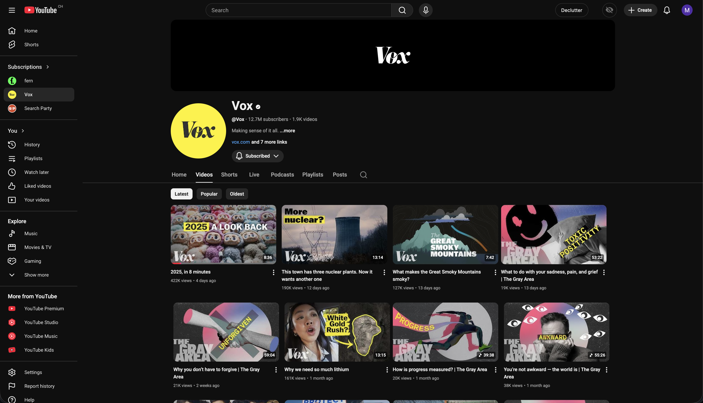

# youtube-inbox

A decluttered YouTube with only videos you haven't seen yet.

## Scripts
- `declutter.js`: hides distractions. Customizable
- `hide-watched-or-rated-videos.js`: hides fully watched and liked/disliked videos
    - Why hide liked/disliked? YouTube has no quick way to mark a video as watched (no API for it). Workaround: use like/dislike to mark videos you've already seen or don't want to finish.

🪄 Vibe coded.

## How to install

Add scripts to `Tampermonkey` or similar browser extension.

## Declutter
### Before

### After

